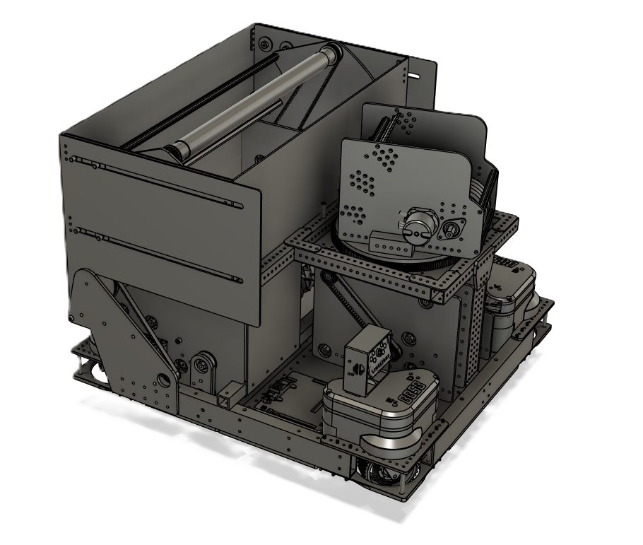
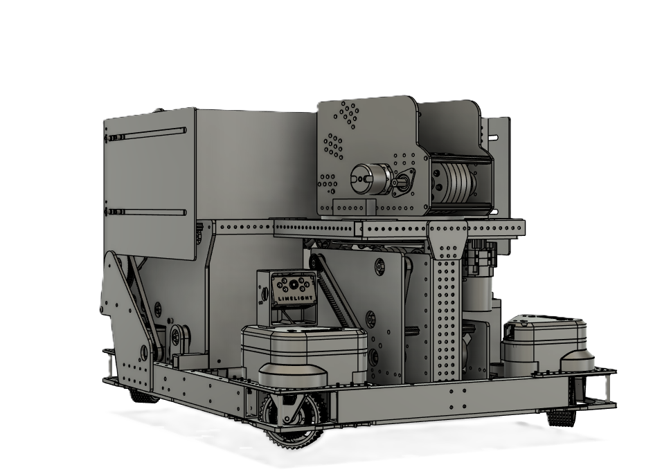

# Summary

FRC Team [8858 Beast From the East's](https://www.thebluealliance.com/team/8858) 2026 robot is named ['Echidna'](https://en.wikipedia.org/wiki/Echidna_(mythology)). Initial inspiration of this robot came from the [Cranberry Alarm Ri3D](https://www.youtube.com/watch?v=qxTU4_RFJNo) design with modifications made as the season went on.

## Capabilities

Table: Echidna's Measurements & Capabilities

|                   | |
|-------------------|-|
| Width             | |
| Length            | |
| Height            | |
| Weight            | |
| Launch Rate       | |
| Scoring Accuracy  | |

## CAD Models

<!-- pagebreak -->

## Button Mapping

Control of this robot requires 1 operator:

Table: Xbox Controller Mapping

| Button Name       | Press or Hold | Functionality                                     |
|-------------------|---------------|---------------------------------------------------|
| Left Stick        | Hold          | Translational Movement (front/back/left/right)    |
| Right Stick       | Hold          | Rotational Movement (turning)                     |
| A                 |               |                                                   |
| B                 |               |                                                   |
| X                 |               |                                                   |
| Y                 |               |                                                   |
| Left Bumper       |               |                                                   |
| Right Bumper      |               |                                                   |
| Left Trigger      | Press         | Intake                                            |
| Right Trigger     | Press         | Shoot Fuel                                        |
| Back              |               |                                                   |
| Start             |               |                                                   |
| Left Stick Press  |               |                                                   |
| Right Stick Press |               |                                                   |
| D-Pad Up          | Press         | Move Hang up                                      |
| D-Pad Down        | Press         | Move Hang Down                                    |
| D-Pad Left        |               |                                                   |
| D-Pad Right       |               |                                                   |

<!-- pagebreak -->
