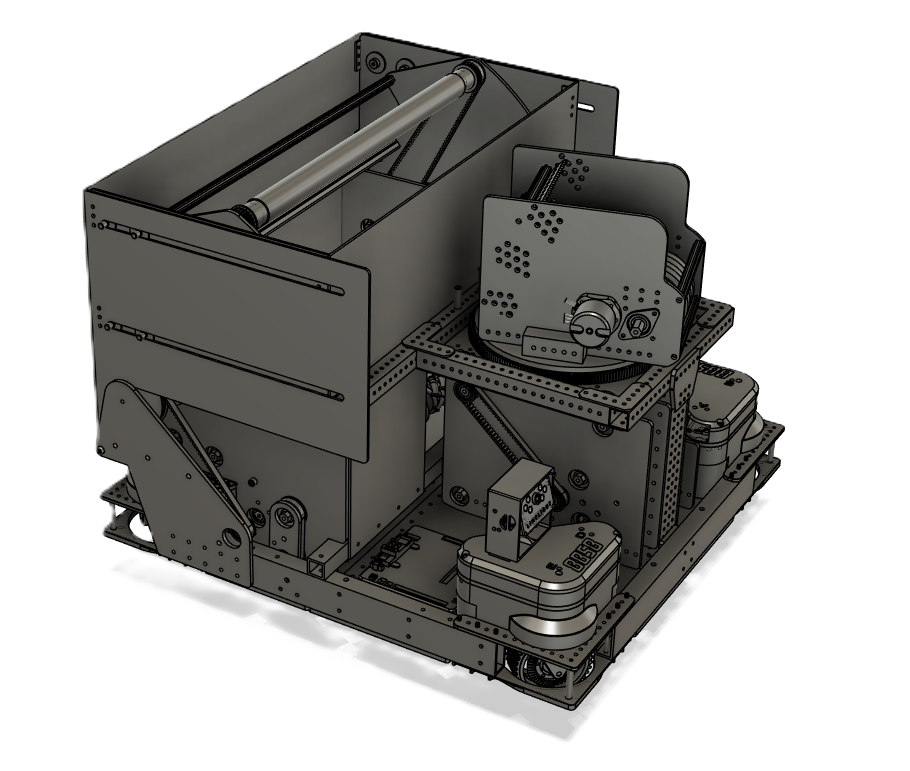
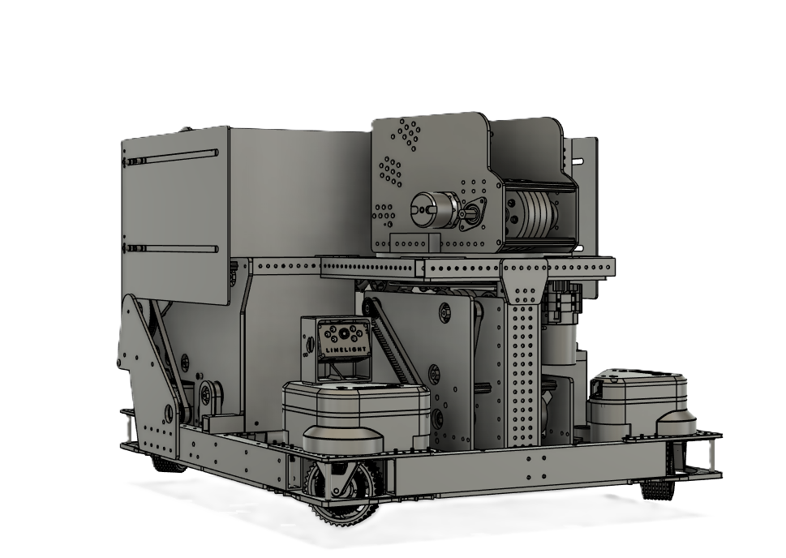
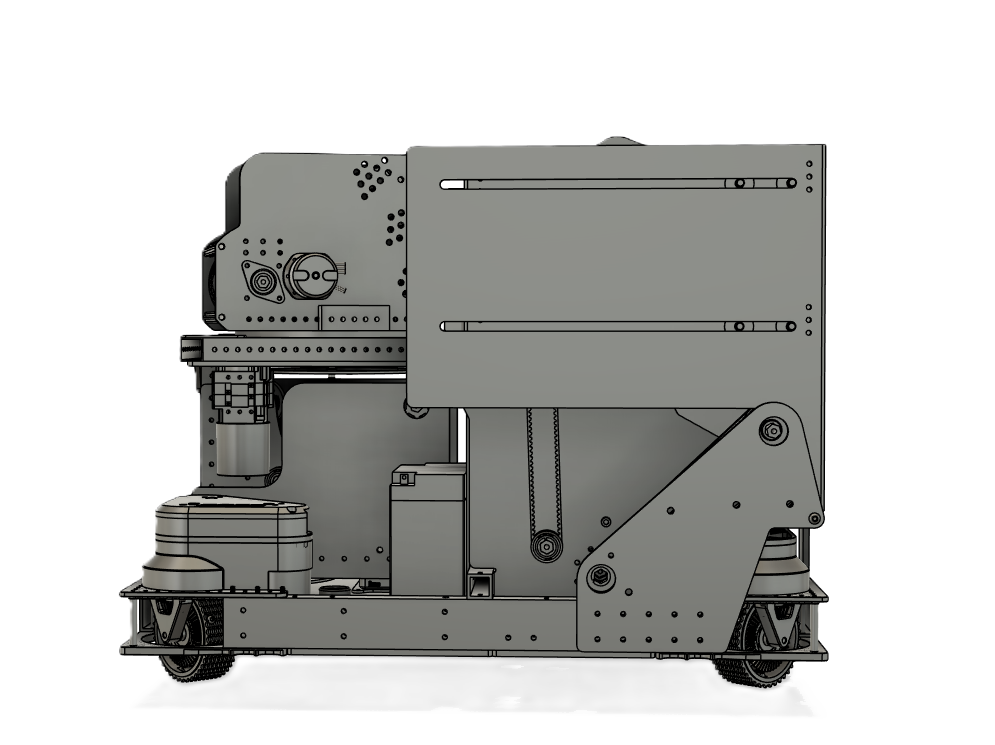

# Summary

FRC Team [8858 Beast From the East's](https://www.thebluealliance.com/team/8858) 2026 robot is named ['Echidna'](https://en.wikipedia.org/wiki/Echidna_(mythology)). As part of our tradition, we keep our team names in alphabetical order and representative of a mythological beast to keep our "Beast From the East" mascot. This year was E-season, and since Echidnas are half-snake half-woman creatures, they would be perfect for the excavation theme of this years Rebuild season. Initial design inspiration of this robot came from the [Cranberry Alarm Ri3D](https://www.youtube.com/watch?v=qxTU4_RFJNo) design with modifications made as the season went on.

## Capabilities

Table: Echidna's Measurements & Capabilities

|                   |                                           |
|-------------------|-------------------------------------------|
| Width             |                                           |
| Length            |                                           |
| Height            |                                           |
| Weight            | 109 lbs. (without bumpers and battery)    |
| Hopper Capacity   | 35 fuel                                   |
| Launch Rate       | 3 fuel per second                         |
| Scoring Accuracy  | 90% (optimal range is ~3m)                |

## CAD Models

<!-- pagebreak -->

## Button Mapping

Control of this robot requires 1 operator.

### Reasoning

* Thumbs remain on joysticks for driving always in regular gameplay
* Intake and Launch most common actions in game
* Climb also requires driver to steer robot
* Reverse Inventory and Software Reset should never be used unless testing or in emergency so keep it away from commonly pressed buttons
* Light modes match *ABXY* colors
* Special/Test modes for D-Pad

{width=100% fig-pos=H}

<!-- pagebreak -->
