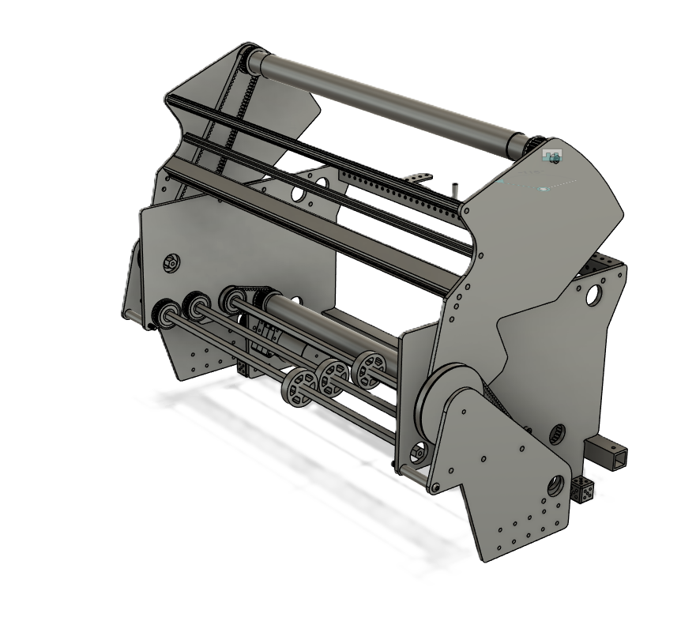

# Intake Subsystem

The intake system is built to make our robot be able to pick up balls from the ground into the robot at a fast rate.

## Coding

* Intial code made from [YAMS](https://github.com/Yet-Another-Software-Suite/YAMS/tree/master/examples/advantage_kit).

```java
private final ArmSubsystem arm = new ArmSubsystem();
```

### Tele-op control

* When a trigger is pressed, the intake will toggle on so the driver doesn't have to keep holding it. When pressed again, it will turn off.

### Autonomous control

* It will rely on beam breaks on the hopper with some help with Pathfinder in order to know when to turn on the intake. Possibly not used in auton due to strategy.

## Electrical

### Feedback

* Encoders: In order to know how much the motor moves
* Distance/IR: In order to know when the hopper is full in order to stop the intake

### Interface types

Table: Intake CAN IDs

| CAN ID | Function                |
|--------|-------------------------|
|14      |Intake Roller Motor      |
|15      |Intake External Motor    |
|17      |Hopper Motor             |

Table: Intake Digital IO IDs

| DIO #  | Function             |
|--------|----------------------|
|0       |Intake Encoder        |
|`[5:3]` |Hopper Level`[2:0]`   |

## Mechanical

* Initial source material source
* [link to the source](https://example.com/) if available

### CAD Models




<!-- pagebreak -->
