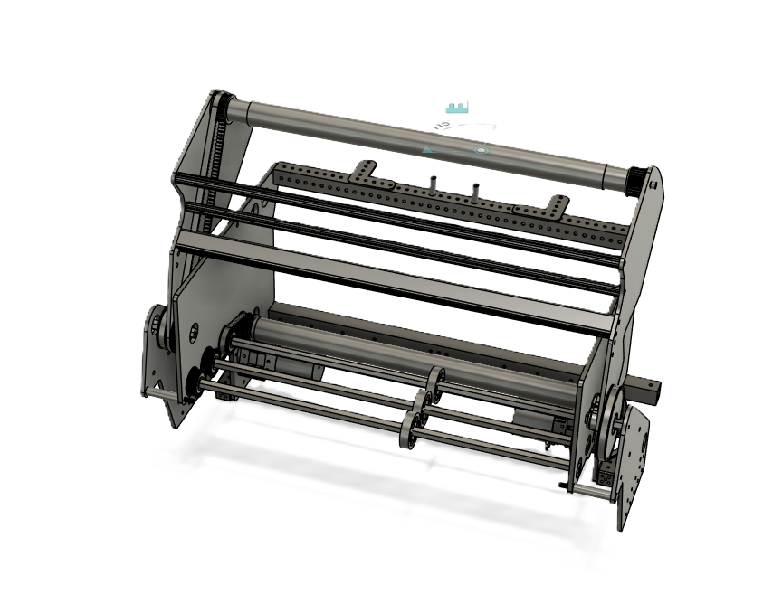
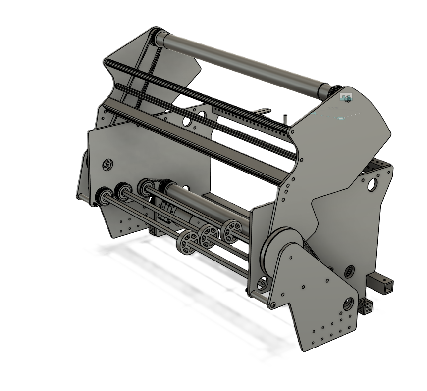
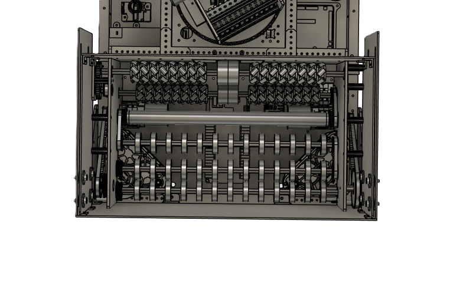

# Intake Subsystem

The Intake Subsystem consists of a motorized arm and roller system designed to pick up spherical game pieces (aka "Fuel") from the ground and feed them into the robot's hopper at a fast rate. Once in the hopper, additional rollers will help feed the fuel into into the launcher subsystem.

## Coding

Intake code is completely original to this robot.

Subsystem definition can be found within `src/main/java/frc/robot/subsystems/` as `IntakeSubsystem.java` and `HopperSubsystem.java`.

```java
// Example instantiation within RobotContainer.java
private final HopperSubsystem hopperSubsystem = new HopperSubsystem();
private final IntakeSubsystem intakeSubsystem = new IntakeSubsystem();
```

The default command for the Intake Subsystem will lower the intake arm and run the intake roller. The hopper rollers will be off by default but turn on during launching.

This command can be found under `src/main/java/frc/robot/commands/IntakeCommand.java`

```java
// example default command for IntakeSubsystem
intakeSubsystem.setDefaultCommand(
    new activateIntake(
        intakeSubsystem,
        hopperSubsystem,
        Constants.INTAKE_ARM_LOWERED,
        Constants.INTAKE_ROLLER_SPEED,
        0.0 // hopper off by default
    )
);
```

### Tele-op control

Intake will default to being active when the robot is enabled. When launching is in progress, the hopper motors activate and the intake arm raises in order to help feed fuel into the launcher, increasing throughput.

### Autonomous control

Autonomous will re-use tele-op commands to run the intake and hopper as needed during autonomous routines.

## Electrical

### Feedback

* Absolute Encoders on Intake arm to reliably control position to repeatable positions using PID control

### Interface types

Table: Intake CAN IDs

| CAN ID | Function                 |
|--------|--------------------------|
|15      |Intake Roller Motor       |
|16      |Intake External Motor     |
|17      |Hopper Motor              |

Table: Intake Digital IO IDs

| DIO #  | Function             |
|--------|----------------------|
|0       |Intake Arm Encoder    |
|`[5:3]` |Hopper Level`[2:0]`   |

## Mechanical

Initial design cam from [Cranberry Alarm Ri3D](https://www.youtube.com/watch?v=qxTU4_RFJNo)
Modifications include:

* removing some hopper wheels on right side of the hopper to avoid fuel jamming at the launcher entrance.

### CAD Models







<!-- pagebreak -->
