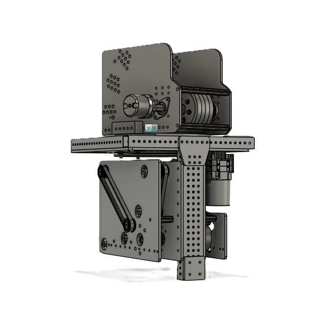
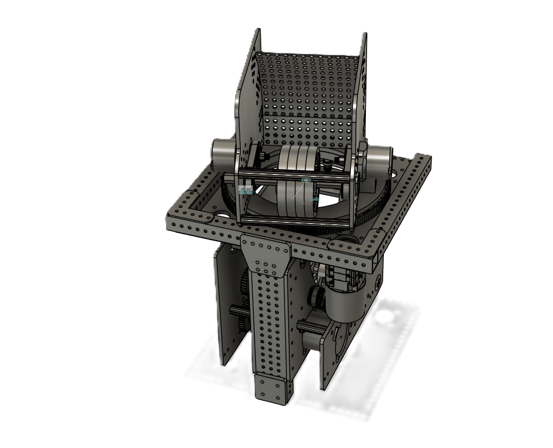

# Launcher Subsystem

* Launch and score fuel into tower and reach RP bonus and count how much fuel has been launched

## Coding

* Intial code made from [YAMS](https://github.com/Yet-Another-Software-Suite/YAMS/tree/master/examples/advantage_kit).

```java
// Example instantiation within RobotContainer.java
private final LauncherSubsystem  launcher  = new LauncherSubsystem();

```

### Tele-op control

* Will use limelight to estimate field position to align turret to launch and a button to launch fuel and empty the fuel inventory in the robot

### Autonomous control

* Will use limelight  to estimate field position to align turret and set launch speed on the launcher and launch pre-loaded fuel

## Electrical

### Feedback

* Beam Break to count fuel output
* Limelight to estimate field position

### Interface types

Table: Launcher CAN IDs

| CAN ID | Function                |
|--------|-------------------------|
|19      |Kicker Motor             |
|20      |Turret Angle Encoder     |
|21      |Launch Left Motor        |
|22      |Launch Right Motor       |

Table: Launcher Digital IO IDs

| DIO #  | Function                |
|--------|-------------------------|
|2       |Turret Output            |

* Wiring Diagram showing both data *and* power connections

## Mechanical

* Initial design cam from [Cranberry Alarm Ri3D](https://www.youtube.com/watch?v=qxTU4_RFJNo)

### CAD Models





<!-- pagebreak -->
