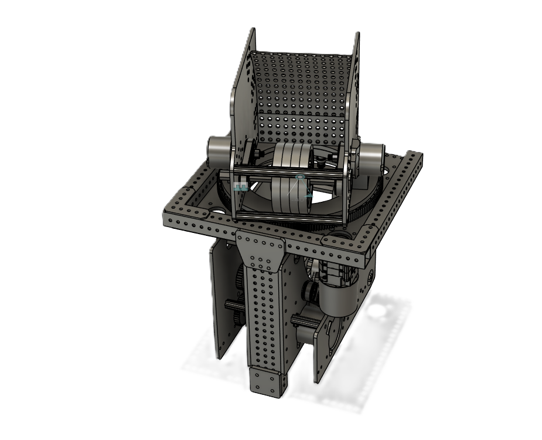

# Launcher Subsystem

The Launcher Subsystem is a turret capable of launching multiple spherical game elements (aka "Fuel") into a target 6' above the ground. Our design consists of 3 elements:

1. **Launcher** - Flywheel system capable of launching fuel at a maximum rate possible while providing consistency for each fuel's exit velocity and trajectory.
2. **Turret** - Moves the launcher assembly rotationally so that fuel can be launched in any desired direction.
3. **Kicker** - Initial motor system bringing fuel from our hopper into the launcher. This should provide a substantial initial velocity so that the launcher motors need to provide a minimal amount of additional energy to the fuel, improving consistency.

In the [2026 FRC Game "Rebuilt"](https://www.youtube.com/watch?v=_fybREErgyM), the majority of scoring is decided by the number of fuel an alliance scores. Additional Ranking Points are awarded for meeting certain thresholds of fuel scored which are critical for reaching higher rankings at FRC competitions.

## Coding

Launcher code is completely original to this robot.

Subsystem definition can be found within `src/main/java/frc/robot/subsystems/LauncherSubsystem.java`.

Subsystem requires a supplier of the Robot's pose to calculate a desired target and set turret/launcher settings to launch fuel at this target.

```java
// Example instantiation within RobotContainer.java
private final LauncherSubsystem launcherSubsystem = new LauncherSubsystem(drive::getPose);
```

Ideal launch speeds for various distances are found by experimentation and added to a `TreeMap` list named `distanceToSpeed`. When calculating a target speed for a given target, `getSpeedForDistance()` will check this mapping for the nearest mapped points and use linear approximation between the two nearest points.

The turret angle is calculated in `aimatTarget()`, this function considers a known target's position on the field as well as the current pose (X,Y coordinates on the field as well as rotational orientation) of the robot. Based on this information, `setTurretAngle()` is called to set the turret to target from the relative robot's POV. If the target angle is outside of the range of the turret, the turret returns to it's 'zero' position.

The primary command used for scoring is `launchCommand()`.

(defined under `src/main/java/frc/robot/commands/launchCommand.java`)

This command handles setting launcher speeds, turret angles as well as driving hopper/intake motors to feed fuel into the launcher. This command is designed to be used in a `whileTrue()` command on an Xbox Controller button, so that the command will run as long as the button is held.

```java
// command to launch Fuel
controller.rightTrigger(0.6).whileTrue(
    new launchCommand(
        launcherSubsystem,
        hopperSubsystem,
        intakeSubsystem
    )
);
```

### Tele-op control

In Tele-Operated mode, the launcher subsystem will automatically decide targets based on the context of where the robot's odometry says it is at on the field. Launching fuel at that target is initialized by pressing and holding the **Right Trigger** on the XBox Controller. If the Robot is in our alliance's scoring zone, the launcher will target our tower for scoring. all other places on the field will target our alliance's scoring zone.

### Autonomous control

Re-use tele-op commands to initiate launches until the fuel output beam-break stops detecting fuel is being launched.

## Electrical

### Feedback

* Beam Break to indicate when Turret is at "Zero" position
* Beam Break to count fuel output to determine throughput
* Limelight + Swerve Odometry to estimate field position
* Encoders on launch motors to feedback velocity for PID control
* Encoders on angle motors to position for PID control

### Interface types

Table: Launcher CAN IDs

| CAN ID | Function                 |
|--------|--------------------------|
|18      |Kicker Motor              |
|19      |Turret Angle Encoder      |
|20      |Launch Left Motor         |
|21      |Launch Right Motor        |
|22      |Hood Motor                |

Table: Launcher Digital IO IDs

| DIO #  | Function                 |
|--------|--------------------------|
|1       |Turret Output             |
|2       |Turret Zero indicator     |

## Mechanical

Initial design cam from [Cranberry Alarm Ri3D](https://www.youtube.com/watch?v=qxTU4_RFJNo)
Modifications include:

* Adding a third flywheel to improve stability while launching fuel
* Beam-break sensor to provide known turret orientation
* LEDs on acrylic to indicate robot status as well as lighting effects

### CAD Models




<!-- pagebreak -->
