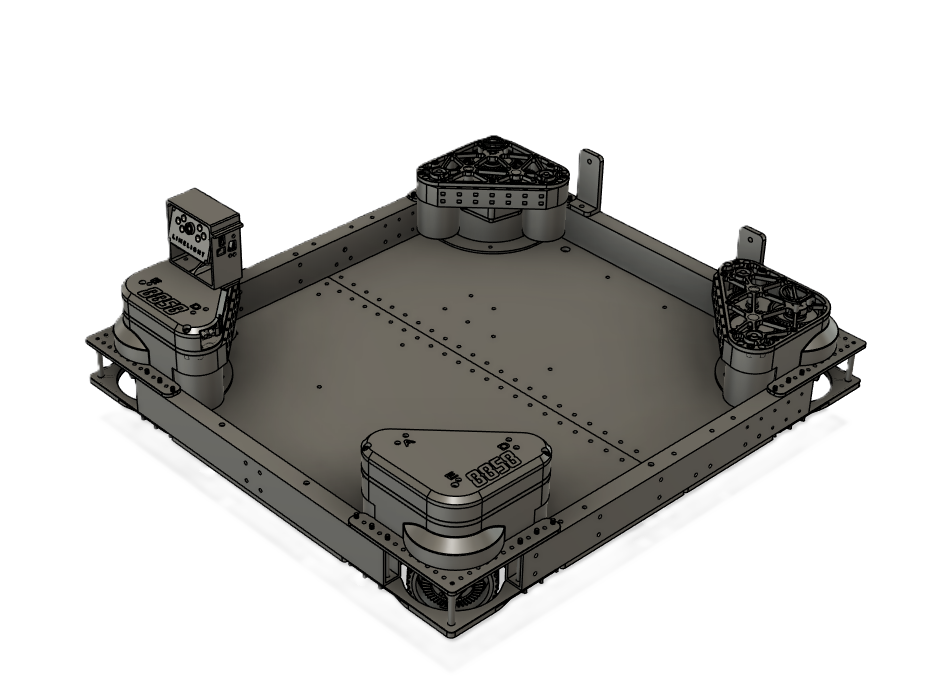

# Swerve Subsystem

* The Swerve Subsystem is built to make the our robot mobile and quick.

## Coding

* Intial code made from [YAMS](https://github.com/Yet-Another-Software-Suite/YAMS/tree/master/examples/advantage_kit).

```java
private final SwerveSubsystem drive = new SwerveSubsystem();
```

### Tele-op control

* The Swerve subsytem is controled by the two joysticks on the drivers controller.

### Autonomous control

* Swerve is controled in in auto by using Path Planner.

## Electrical

### Feedback

* Sensor Types and their use-cases

### Interface types

* Each motor and encoder is connected to the robot via the CAN Bus.

Table: Swerve CAN IDs

| CAN ID | Function                |
|--------|-------------------------|
|1       |Front Left Encoder       |
|2       |Front Left Angle Motor   |
|3       |Front Left Drive Motor   |
|4       |Front Right Encoder      |
|5       |Front Right Angle Motor  |
|6       |Front Right Drive Motor  |
|7       |Back Left Encoder        |
|8       |Back Left Angle Motor    |
|9       |Back Left Drive Motor    |
|10      |Back Right Encoder       |
|11      |Back Right Angle Motor   |
|12      |Back Right Drive Motor   |

* Wiring Diagram showing both data *and* power connections

## Mechanical

* Initial source material source
* [link to the source](https://example.com/) if available

### CAD Model



<!-- pagebreak -->
