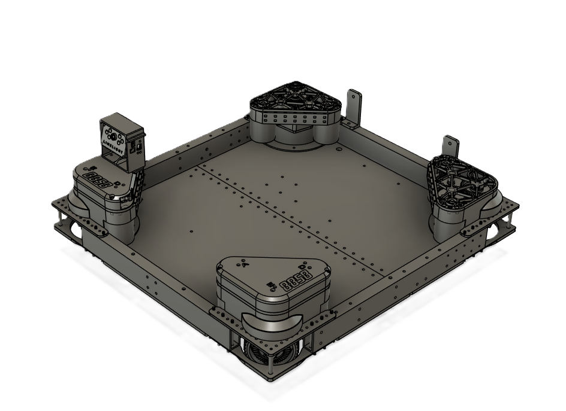

# Swerve Subsystem

The Swerve Subsystem is made to allow for full mobility around the field. The use of independent direction and angle motors gives Echidna the ability to have independant turning and drive capabilities, allowing Echidna drive throughout the field without the limitations of a regular tank drive.

## Coding

* Intial code from from [YAGSL](https://github.com/Yet-Another-Software-Suite/YAGSL/tree/main/examples/full_example).

```java
// Example instantiation within RobotContainer.java
private final SwerveSubsystem drive = new SwerveSubsystem();
```

### Tele-op control

Swerve subsytem is controled by the two joysticks on the drivers controller.

* Left joystick will control translational movement (forward/backwards/left/right) relative to the driver's point of view.
* Right joystick will control rotational movement of the robot

The joystick inputs are processed by a `SwerveInputStream` defined as below within `DriverControls.java`:

```java
CommandXboxController controller = new CommandXboxController(controllerPort);

/**
 * Maps Controller inputs to a SwerveInputStream for
 * field-oriented driving with alliance-relative
 * controls and a deadband
 */
SwerveInputStream driveInputStream = SwerveInputStream.of(
    drivetrain.getSwerveDrive(),
    () -> controller.getLeftY() * 1,
    () -> controller.getLeftX() * 1
)
.withControllerRotationAxis(() -> controller.getRightX() * -1)
.robotRelative(false)
.scaleTranslation(Constants.TRANSLATION_SCALE)
.scaleRotation(Constants.ROTATION_SCALE)
.deadband(Constants.DEADBAND);

drivetrain.setDefaultCommand(
    drivetrain.driveFieldOriented(driveInputStream).withName("Drive" + ".test")
);
```

### Autonomous control

Swerve is controlled in auto by using Path Planner. Path Planner is a program that uses algorithms to compute a safe, collision-free trajectory from a starting point to end target position while keeping in mind robot dimensions and field elements.

## Electrical

### Feedback

* CANcoders
* [NavX](https://docs.wpilib.org/en/stable/docs/software/hardware-apis/sensors/gyros-software.html#navx) used as gyro. Connected via SPI ([Serial Peripheral Interface](https://en.wikipedia.org/wiki/Serial_Peripheral_Interface)) as recommended by [Studica](https://pdocs.kauailabs.com/navx-mxp/guidance/selecting-an-interface/) for being highest-speed and lowest-latency.
* [Limelight](https://docs.limelightvision.io/en/latest/) for vision processing. Provides an estimation of the robot's pose.

### Interface types

* Each motor and encoder is connected to the robot via the CAN Bus.

Table: Swerve CAN IDs

| CAN ID          | Function                |
|-----------------|-------------------------|
| **Front Left**  |                         |
|1                |Front Left Encoder       |
|2                |Front Left Angle Motor   |
|3                |Front Left Drive Motor   |
| **Front Right** |                         |
|4                |Front Right Encoder      |
|5                |Front Right Angle Motor  |
|6                |Front Right Drive Motor  |
| **Back Left**   |                         |
|7                |Back Left Encoder        |
|8                |Back Left Angle Motor    |
|9                |Back Left Drive Motor    |
| **Back Right**  |                         |
|10               |Back Right Encoder       |
|11               |Back Right Angle Motor   |
|12               |Back Right Drive Motor   |

## Mechanical

Each of the 4 Swerve Modules are MK4i modules from [Swerve Drive Specialties](https://www.swervedrivespecialties.com/products/mk4i-swerve-module) in the L2 Configuration. These swerve modules have been reused from the 2025 FRC season.

### CAD Model




<!-- pagebreak -->
